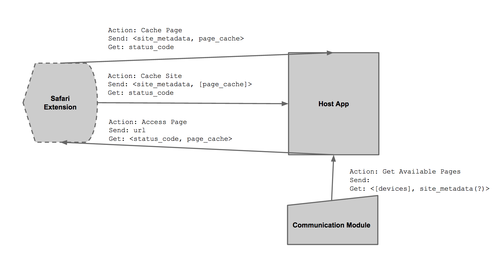

WebCranck
=========

Share roaming data on your iPhone.

##Overview

Popsicle is an iOS browser extension the users locally cache the webpages for further use in situations where they do not have access to internet connection.

It also let's the users share the locally cached data with other devices around them. This is especially useful in cases where you are traveling with other people.

## Technical Overview

There are three main parts to the application:

* Browser extension
* App that serves as the host app and the interface to interact with other devices around
* Communication module that facilitates the connections between the devices around

These three parts needs to be as decoupled as possible.

## Main objects

The communication between the modules should be based on these three objects. All of the will extned from `NSCoding` class that enables encoding and decoding of the objects. This will give us a good interface for neater code and flexibility of saving things as files. 

### site_metadata
* hostname (string)
* port (int)
* last update (date)
* directory_path (string)
* owner (device)

### page_cache
* full_url (string)
* url_path (string)
* parameters [string]
* last_update (date)
* site (site_metadata)

### device
* uid (string)
* location (location)
* name (string)
* cache [site_metadata]
